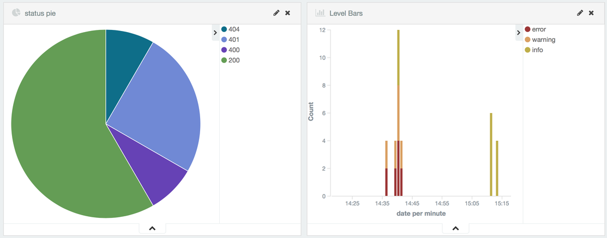

.. role:: python(code)
    :language: python

Django Logging
==============

A Django library that logs request, response and exception details in a JSON document.
It uses the python rotation mechanism to rotate the file logs, but the rotation files will be gziped and it has support for sending the log messages to Elasticsearch.

.. image:: https://badge.fury.io/py/django-logging-json.svg
    :target: https://badge.fury.io/py/django-logging-json

Installation
============

.. code-block:: python

    pip install git+https://github.com/cipriantarta/django-logging

or

.. code-block:: python

    pip install django-logging-json

Quick start
===========
1. Add "django_logging" to your INSTALLED_APPS settings like this:

.. code-block:: python

    INSTALLED_APPS = (
        ...
        'django_logging',
    )

2. Include the DjangoLoggingMiddleware middleware in your MIDDLEWARE_CLASSES like this:

.. code-block:: python

    MIDDLEWARE_CLASSES = (
        'django_logging.middleware.DjangoLoggingMiddleware',
        ...
    )

Handlers
========

AppFileHandler
--------------

This handle will log request/response info to ``LOG_PATH/app.log``. It will also log request/exception, for unhandled exceptions, in the same file.
Log format:

Request and Response

.. code-block:: javascript

    {
        "INFO":
        {
            "timestamp":
            {
                "request": {
                ... request info ...
                },
                "response": {
                ... response info ...
                }
            }
        }
    }

Request and Exception

.. code-block:: javascript

    {
        "ERROR":
        {
            "timestamp":
            {
                "request": {
                ... request info ...
                },
                "exception": {
                    "message": "Exception message",
                    "traceback": [
                        ...
                    ]
                }
            }
        }
    }

SQLFileHandler
--------------

This handler will log all queries to ``LOG_PATH/sql.log``.
In a production environment you should set ``LOG_LEVEL = Error`` or ``SQL_LOG = False`` to avoid performance issues.
The queries will also be logged to the console if ``CONSOLE_LOG`` is set to ``True``

DebugFileHandler
----------------

This handler will log debug messages to ``LOG_PATH/debug.log``. This handler is only used when ``settings.DEBUG`` is set to ``True``.

Log format:

.. code-block:: python

    [%(levelname)s - %(created)s], file:%(module)s.py, func:%(funcName)s, ln:%(lineno)s: %(message)s

Custom Use
==========

To log debug messages:

.. code-block:: python

    from django_logging import log

    log.debug('debug message')

To log handled exceptions:

.. code-block:: python

    from django_logging import log, ErrorLogObject

    log.error(ErrorLogObject(request, exception, duration))

Settings
========
Inspired by Django Rest Framework, Django Logging settings are grouped in a single dictionary.

To override Django Logging settings, add a dictionary in your project's settings file

.. code-block:: python

    DJANGO_LOGGING = {
        "CONSOLE_LOG": False
    }

Default Settings
----------------

:python:`CONSOLE_LOG = True` - Log to console.

:python:`SQL_LOG = True` - Log SQL queries.

:python:`SQL_THRESHOLD = 0.5` - Log slow queries only.

:python:`LOG_LEVEL = 'debug'` - If settings.DEBUG is set to True, otherwise LOG_LEVEL is set to 'info'

:python:`DISABLE_EXISTING_LOGGERS = True` - Set this to False if you want to combine with multiple loggers.

:python:`LOG_PATH = '{}/logs'.format(settings.BASE_DIR)` - If the logs folder does not exist, it will be created.

:python:`IGNORED_PATHS = ['/admin', '/static', '/favicon.ico']` - List of URL endpoints to ignore.

:python:`RESPONSE_FIELDS = ('status', 'reason', 'charset', 'headers', 'content')` - List of response fields to log.

:python:`CONTENT_JSON_ONLY = True` - Log response content only if its a JSON document.

:python:`ROTATE_MB = 100` - Maximum size in MB that the log file can have before it gets rotated.

:python:`ROTATE_COUNT = 10` - Maximum number of rotated log files.

:python:`INDENT_CONSOLE_LOG = 2` - Indent console log by "n" spaces.

:python:`ELASTICSEARCH_ENABLED = False` - Set to yes to enable elasticsearch support.

:python:`ELASTICSEARCH_HOSTS = ["localhost"]` - Elasticsearch hosts

:python:`ELASTICSEARCH_INDEX = "django-logging-json"` - Elasticsearch index name

:python:`ELASTICSEARCH_SSL = False` - Elasticsearch connection via SSL (:443)

:python:`ELASTICSEARCH_AUTH = ('user', 'password)` - Elasticsearch authorization credentials (user, password). Defaults to `None`

Change Log
==========
1.12 [2017-11-09]
-----------------
- bug fixes

1.11 [2017-11-09]
-----------------
- bug fixes

1.10 [2017-11-02]
----------------
- adds a 0.5 threshold for SQL queries to be logged. Spamming the logs with fast queries is unnecessary

1.9 [2017-10-26]
----------------
- adds send to es onf a different thread

1.7 [2017-10-26]
----------------
- log sql queries in DEBUG mode as well

1.6 [2017-10-26]
----------------
- fixes a bug where messages were being sent to elasticsearch twice
- logs sql queries from scripts(managements commands, etc.) instead of just from a web request

1.5.9 [2017-10-19]
------------------
- adds "raw" to exception messages
- uses pprint instead of json dumps for console output

1.5.8 [2017-10-03]
------------------
- allow "raw" messages to be logged.

1.5.6 [2017-10-02]
------------------
- adds support for Elasticsearch SSL connection and authorization

1.5.5 [2017-06-21]
------------------
- fixes compatibility for django MIDDLEWARE `django >= 1.10` 

1.5.4 [2017-02-08]
------------------
- fixes compatibility with python < 3.5 when logging exceptions

1.5.3 [2016-06-26]
------------------
- bug fixing

1.5 [2016-06-04]
----------------
 - do not return a response in process_exception. Give other middlewares a chance to process the exception.
 - console log indentation
 - elastic search support. below a sample chart using kibana with elasticsearch and django-logging

1.4 [2016-02-19]
----------------

 - bug fixing
 - added support for query logging when using multiple database
 - added database alias for sql logs if multiple databases are used
 - added plain dict logging support

1.3 [2015-12-13]
----------------

 - added support for Python 2.7
 - added support for Django >= 1.4

1.2 [2015-11-22]
----------------
 - added sql logging support
 - log entries are now sorted by keys
 - console handler now indents the log entries by 4 spaces
 - log response content if it's JSON (bug)

1.1 [2015-11-17]
----------------
 - added exception "type" for exception log entries
